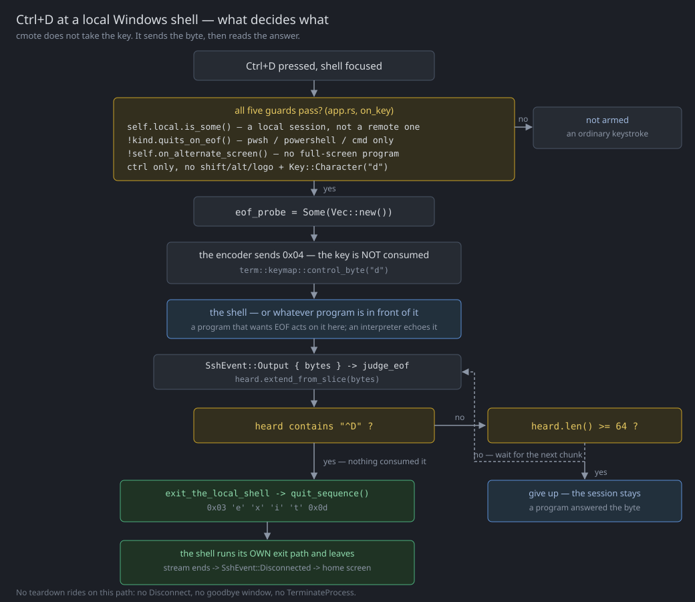
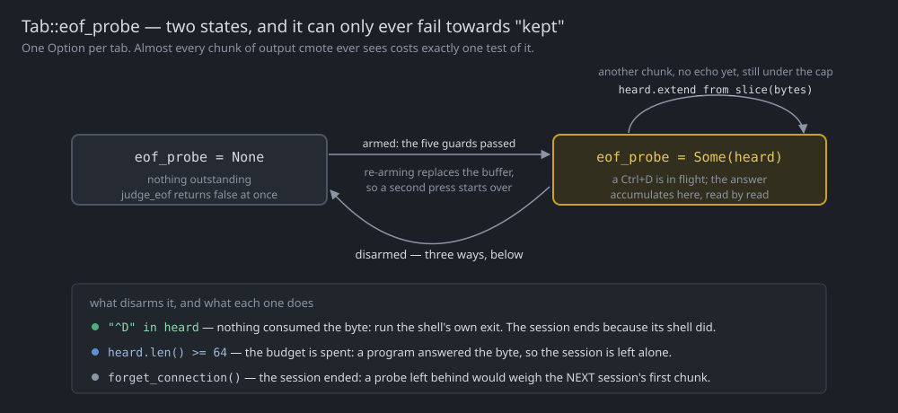
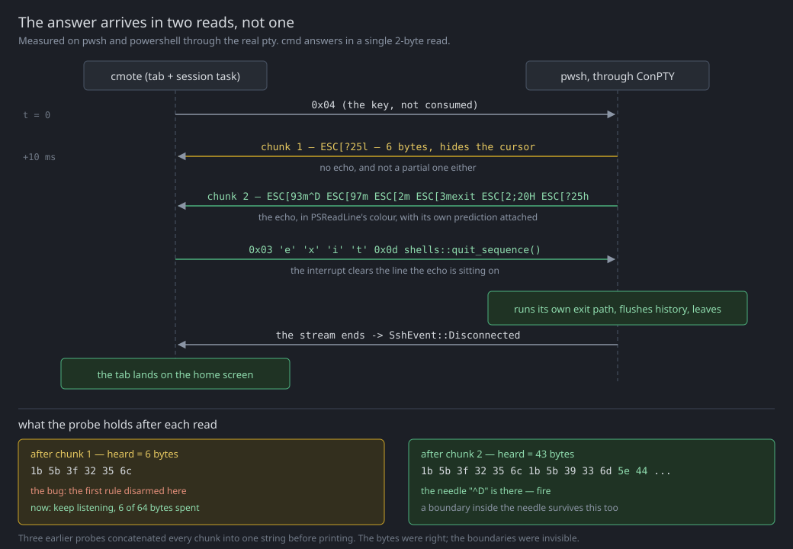
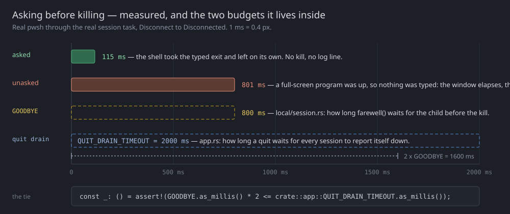

# Ctrl+D in a local `pwsh`, `powershell` or `cmd` tab

How cmote makes Ctrl+D end a local session on the three Windows interpreters, which do not act on the
byte at all — without taking the key away from whatever program is running at that prompt.

This documents the implementation as it stands. The design log for it is `PLAN.md` §104; the
user-facing half is in [README.md](../README.md) (the keyboard table, the tour's quit paragraph, and
manual-test step 16). This file is the detail neither of those has room for: every guard, every
constant, every measurement, and what each test pins down.

**Contents**

- [The problem](#the-problem)
- [The measured facts](#the-measured-facts)
- [The rule](#the-rule)
- [The pieces, file by file](#the-pieces-file-by-file)
- [The life of one press](#the-life-of-one-press)
- [Why the answer is accumulated](#why-the-answer-is-accumulated)
- [The other Ctrl+D: closing the tab](#the-other-ctrld-closing-the-tab)
- [Teardown: asking before killing](#teardown-asking-before-killing)
- [Every guard, and what it is for](#every-guard-and-what-it-is-for)
- [The tests](#the-tests)
- [Known limits](#known-limits)
- [Where to change what](#where-to-change-what)

---

## The problem

cmote pairs two Ctrl+D presses into one motion, exactly as a terminal does:

1. Ctrl+D at the shell is EOF. The shell logs out, the session ends, and the tab lands on the home
   screen.
2. Ctrl+D on the home screen closes the tab.

The first half assumes the shell answers EOF. Every remote cmote can reach is a POSIX shell and does.
Three of the six local shells in the catalogue do not — so in a `pwsh`, `powershell` or `cmd` tab the
key did nothing at all, and the second half of the gesture was unreachable without the mouse.

The three interpreters do have an EOF, and it is Ctrl+Z — but even that only ever means "end of
stream" to a program *reading* one. There is no byte that tells the interpreter itself to stop.
`exit` is a command, not a key.

## The measured facts

Everything below came from throwaway probes driving real ConPTY children through the real
[local/pty.rs](../src/local/pty.rs), answering the `CSI 6 n` cursor query the way the GUI does (a
shell whose query goes unanswered never finishes starting up, which invalidated the first attempt at
the timing table).

### What `0x04` does at a bare prompt

| Shell | `0x04` at the prompt | first byte back |
|---|---|---|
| Git Bash (MSYS `bash`), and `zsh` / `bash` on macOS | prints `logout` and **exits** — the session ends by itself | 1 ms |
| `pwsh` | **echoes** `ESC[93m^D` onto its input line, keeps running | 10 ms |
| `powershell` | the same 19 bytes, the same colour, keeps running | 17 ms |
| `cmd` | echoes the two characters `^D` bare, keeps running | 0 ms |

The echo column is the one the design turned out to hang on, and the first version of the design log
was **wrong** about it — it recorded "no exit, no output", because that probe watched the child
process handle and never looked at the bytes. There is a signal here, and it had been measured away
by asking a narrower question than the design needed.

### How the echo arrives

Both PowerShells answer in **two reads**:

| chunk | bytes | length |
|---|---|---|
| 1 | `ESC[?25l` | 6 |
| 2 | `ESC[93m^D` `ESC[97m` `ESC[2m` `ESC[3mexit` `ESC[2;20H` `ESC[?25h` | 37 |

`cmd` answers in a single 2-byte read. That difference is the whole of a bug this shipped with — see
[Why the answer is accumulated](#why-the-answer-is-accumulated).

### A program in front of the shell

`node` v24.18.0 at a local `pwsh` prompt, real ConPTY:

- `0x04` makes node **exit by itself**, and `pwsh` answers with `\r\nPS C:\Users\cme> ` — a fresh
  prompt, **no echo**. So the same key does the right thing on both sides of the same tab without
  cmote knowing what is running.
- The node REPL stays on the **main screen**: `is_alternate()` is `false`. Which is why the
  full-screen guard could never have covered this case, and why the rule reads the shell's answer
  instead of guessing from the grid.

### A nested shell

A `pwsh` started inside the tab's `pwsh` echoes `^D` too. The sequence cmote sends then ends **that**
one: output comes back at the outer `PS C:\Users\cme>` prompt and the session's own shell is still
running. This is the property that argues for the whole indirection — see [The rule](#the-rule).

### What makes the typed `exit` land

Same shell, same sequence, once on an empty input line and once on a half-typed one (`Get-Chi`), with
only the prefix changed:

| prefix | what happened |
|---|---|
| `0x03` (Ctrl+C) | the shell left, in **all six** cases (3 shells × 2 lines) |
| `0x08` (backspace) | fine on an empty line; on `Get-Chi`, `pwsh` ran `Get-` with a PSReadLine prediction attached and `powershell` ran `Get-exit` |
| nothing | `^Dexit` — refused everywhere |

An earlier measurement made the backspace look sufficient: with it, `pwsh` showed `exit` in
PSReadLine's green and left in 99 ms; without it, `^Dexit` in red, `exit: The term 'exit' is not
recognized…`, still running at 2.5 s. Both true — and both taken on an **empty** line, which is
exactly the case where erasing one character is enough.

## The rule

**Ctrl+D is not taken.** It goes to the shell exactly as it would in any terminal, and what comes
back decides whether the session ends.

The first attempt did take it: on a shell that ignores EOF, the key ran the teardown directly. That
was wrong in the case that matters most, and the report came back within the hour — with `node`
running at that prompt, Ctrl+D belongs to node. Taking the key threw away a program's own EOF
handling in favour of something cruder, and a `pwsh` tab could not be used to run a REPL any more.

There are exactly two answers to read, because a Windows interpreter handed a control byte it has no
meaning for puts it on its input line and draws it as `^D`:

| the answer | what it means | what cmote does |
|---|---|---|
| contains **`^D`** | nothing consumed the byte — this is the shell's own EOF being ignored | runs the shell's **own** `exit` |
| **anything else** — a fresh prompt after node exited, a pager scrolling, program output | the byte did its job | nothing; the session is not cmote's business |

The cost of being right is one output round trip: 10–17 ms, measured.



### The answer is `exit`, not a teardown

cmote tears nothing down on this path. It sends an interrupt to clear the input line — which is
carrying the `^D` the shell just echoed onto it — and types `exit`. Then the shell does what `exit`
does: runs its own exit path, leaves, and the session ends *because its shell ended*, arriving through
the same `Disconnected` route as a shell the user quit by hand.

That indirection buys three things a teardown could not:

- **What ends is what echoed.** The nested-shell case above is measured, and a version that ran the
  session's teardown would have closed the tab out from under a nested shell.
- **Nothing is ever killed here.** No `Disconnect`, so no goodbye window and no `TerminateProcess`
  fallback.
- **"Nothing happened" is a real outcome.** A shell that refuses the word leaves the session exactly
  where it was — the direction every wrong answer in this rule fails in.

There is no confirmation card, for a plainer reason than before: this is not a teardown to confirm, it
is four characters typed at a prompt. The Disconnect **button** keeps its modal.

## The pieces, file by file

### [src/local/shells.rs](../src/local/shells.rs) — what a shell is like

`Kind::quits_on_eof()` writes the split down per shell rather than inferring it from a name at the
call site. It is the term that decides whether Ctrl+D is the shell's key or cmote's business:

```rust
pub fn quits_on_eof(self) -> bool {
	match self {
		// MSYS bash and the macOS shells are POSIX shells and log out on EOF.
		Self::GitBash | Self::Zsh | Self::Bash => true,
		// The interpreters that ignore the byte.
		Self::Pwsh | Self::PowerShell | Self::Cmd => false,
	}
}
```

`QUIT_COMMAND` is `"exit"` — one word for all six shells, which is the rare case where the four
dialects agree (`cd` needed a method per shell and this needs none). It is *typed*, so it runs
whatever that shell runs on the way out: PSReadLine's history flush, a `~/.bash_logout`, an exit trap
the user set.

`quit_sequence()` is the whole of what goes to a shell to make it leave:

```rust
pub fn quit_sequence() -> Vec<u8> {
	let mut bytes = vec![CANCEL_LINE];
	bytes.extend_from_slice(QUIT_COMMAND.as_bytes());
	bytes.push(b'\r');
	bytes
}

/// The byte a terminal sends for Ctrl+C: "throw away the line I was typing".
const CANCEL_LINE: u8 = 0x03;
```

The `0x03` is not politeness; it is what makes the word land (see the prefix table above). Two things
end up on that input line without the user meaning them to: a command they started typing and changed
their mind about, and — on this path — the `^D` the shell itself just echoed there. Ctrl+C discards
both and gives a fresh prompt, which is what a person does before typing `exit`.

### [src/app.rs](../src/app.rs) — all of the policy

Three constants:

| constant | value | what it is |
|---|---|---|
| `EOF_ECHO` | `b"^D"` | how all three interpreters render an ignored control byte. A short needle, so it is only ever looked for in the answer to a Ctrl+D cmote itself sent, never in output at large |
| `EOF_ANSWER_CAP` | `64` | how many bytes of the answer are examined before the probe gives up. Six is what the measured shells say before echoing, so this is an order of magnitude of room — and it is also the window in which someone else's `^D` could be mistaken for the echo, so it is deliberately small rather than generous |
| `QUIT_DRAIN_TIMEOUT` | `2 s` | §30's quit budget, made `pub(crate)` so the goodbye window can be tied to it at compile time |

One field on the tab:

```rust
/// A Ctrl+D sent to a local shell that may not act on it, and what has come back since (§104).
eof_probe: Option<Vec<u8>>,
```



**Arming**, in `on_key`, after the focus dispatch and the copy bindings — and deliberately *not*
returning, so the encoder below still sends the byte:

```rust
if modifiers.control()
	&& !modifiers.shift()
	&& !modifiers.alt()
	&& !modifiers.logo()
	&& self.local.is_some_and(|kind| !kind.quits_on_eof())
	&& !self.on_alternate_screen()
	&& matches!(&key, iced::keyboard::Key::Character(character) if character.as_str() == "d")
{
	// Armed, and then deliberately NOT returned from: the encoder below sends the byte.
	self.eof_probe = Some(Vec::new());
}
```

Matched on the **logical character**, unlike the copy/paste bindings a few lines above it, which match
the physical key so they hold on any layout. This one accompanies a byte the encoder derives from that
same character — `term::keymap::control_byte` turns `"d"` into `0x04` — so the key that sends EOT is
the key that is watched. It is also the match §30's home-screen Ctrl+D uses, which keeps the two
halves of the gesture one key rather than two that happen to agree on QWERTY.

**Judging**, from the `SshEvent::Output` arm, weighed *before* the bytes reach the emulator:

```rust
fn judge_eof(&mut self, bytes: &[u8]) -> bool {
	let Some(heard) = self.eof_probe.as_mut() else {
		return false;
	};
	heard.extend_from_slice(bytes);
	if heard
		.windows(EOF_ECHO.len())
		.any(|window| window == EOF_ECHO)
	{
		self.eof_probe = None;
		return true;
	}
	if heard.len() >= EOF_ANSWER_CAP {
		self.eof_probe = None;
	}
	false
}
```

`false` whenever no Ctrl+D is outstanding, which is almost every chunk of output cmote ever sees — so
the cost of this on the hot path is one `Option` test.

**Answering**:

```rust
fn exit_the_local_shell(&mut self) -> iced::Task<Message> {
	self.send_command(SshCommand::Input(crate::local::shells::quit_sequence()));
	iced::Task::none()
}
```

**Two supporting reads**:

- `on_alternate_screen()` — `terminal.screen().is_alternate()`, with no terminal counting as "no",
  which is the same answer for the purpose here: nothing is holding the keyboard.
- `forget_connection()` clears `eof_probe` along with the connection label and the local kind. A probe
  left behind would weigh the **first** chunk of the next session opened on that tab, and could end
  it.

### [src/local/session.rs](../src/local/session.rs) — the graceful teardown

`GOODBYE` is 800 ms: how long a shell is given to leave on its own after the typed `exit`, before
`Pty::close` terminates it. `farewell()` waits for it and **drains** the output while waiting:

```rust
async fn farewell(stream: &mut super::pty::Stream) -> bool {
	let left = tokio::time::timeout(GOODBYE, async {
		loop {
			tokio::select! {
				biased;
				// Drained, not forwarded. `None` is the stream ending, which means the pty is already gone.
				chunk = stream.bytes.recv() => {
					if chunk.is_none() { break }
				}
				// The shell exited on its own, which is the whole point of waiting.
				_ = stream.exited.recv() => break,
			}
		}
	})
	.await
	.is_ok();
	if !left {
		eprintln!("the local shell did not leave on its own; ending it the hard way");
	}
	left
}
```

The drain is load-bearing rather than tidy: the channel between the reader thread and here is bounded,
so a shell whose last words filled it would block writing them, never reach its own exit, and the wait
would time out on a shell that was trying to leave.

The return value is for the log only. Both outcomes are correct — one is the shell leaving, the other
is the kill that follows doing its job — so nothing branches on it.

## The life of one press

| where you are | what the shell answers | what happens |
|---|---|---|
| bare `pwsh` / `powershell` / `cmd` prompt | `ESC[?25l`, then `ESC[93m^D…` | cmote types `0x03 exit CR`; the shell runs its exit path; `Disconnected`; the tab lands on the home screen |
| `node` (or any REPL) at that prompt | node exits, `pwsh` prints a fresh prompt — no echo | node is gone, the shell is where it was, the session stays. 64 bytes later the probe gives up |
| a `pwsh` nested inside the tab's `pwsh` | the inner one echoes `^D` | the **inner** shell leaves; output returns to the outer prompt; the session is untouched |
| `vim`, or anything on the alternate screen | not asked — the probe is never armed | the key is the program's, encoded to `0x04` and sent, and cmote does not watch |
| Git Bash, `zsh`, `bash` | the shell prints `logout` and exits by itself | nothing to arm: `quits_on_eof()` is `true`, so this path is not entered at all |
| **Ctrl+Shift+D**, anywhere | whatever it likes | the same `0x04` is sent and **not** watched — the way to hand a bare EOF to a shell that would echo it |



## Why the answer is accumulated

The first version of `judge_eof` settled on the **first chunk**, on the reasoning that a probe
outliving its keypress would start weighing unrelated output — with one exception for a chunk ending
in `^`, in case a read boundary fell inside the needle.

Both PowerShells then failed in the user's hands: `^D` appeared on screen and nothing else happened.
Chunk 1 is `ESC[?25l`, six bytes with no echo in them and not a partial one either, so the rule
decided "some program answered the byte", disarmed, and left the echo to be drawn. `cmd` answers in a
single 2-byte read and worked — and one shell of three passing is what a wrong boundary assumption
looks like from the outside.

Three probes had already been run over this exact exchange and none of them *could* have caught it:
each concatenated every chunk into one string before printing, because what was being asked was "what
does the shell say", not "how does it arrive". The bytes were right in all three. The boundaries were
invisible.

The fixture-fed unit tests had the same blind spot by construction — they feed bytes someone chose,
and the split that had been invented for them fell *inside* the needle, which is the case that already
worked. So the suite now drives a live `pwsh`; see
[`a_real_local_shell_answers_ctrl_d_by_leaving`](#the-tests).

The accumulating version can only fail towards "the session stays": running out of budget means giving
up, and giving up means the session is left alone. Every wrong answer reads as "Ctrl+D did nothing"
and never as "the session ended by itself".

## The other Ctrl+D: closing the tab

The same report that named the `node` case also said "the tab just closed instantly". It had — and a
single press cannot do that, because ending a session lands on the home screen and leaves the tab
alone. Two key events can, and a held Ctrl+D produces them: the first ended the shell, the
**auto-repeat** arrived on the home screen a few tens of milliseconds later, and §30's second half
closed the tab. The screen the gesture is meant to land on was never seen.

```rust
fn is_close_tab(
	key: &iced::keyboard::Key,
	modifiers: iced::keyboard::Modifiers,
	repeat: bool,
) -> bool {
	modifiers.control()
		&& !modifiers.alt()
		&& !modifiers.logo()
		&& !repeat
		&& matches!(key, iced::keyboard::Key::Character(character) if character.as_str() == "d")
}
```

Holding a key is one press, which is what §30 meant by two presses all along. Extracted as a predicate
beside `is_typing` and `is_paste` for the ordinary reason: what a key *means* is the testable half of a
handler that otherwise only returns an opaque `iced::Task`.

Shift is **not** excluded here, since Ctrl+Shift+D has no meaning on the home screen — that exclusion
belongs to the terminal screen, where it is the escape hatch.

## Teardown: asking before killing

`Tab::end_session` replaced the plain `SshCommand::Disconnect` at **every** teardown — the Disconnect
button, a tab closing, cmote quitting — because the difference was never in *why* the session ends:

```rust
fn end_session(&mut self) {
	if self.local.is_some() && !self.on_alternate_screen() {
		self.send_command(SshCommand::Input(crate::local::shells::quit_sequence()));
	}
	self.send_command(SshCommand::Disconnect);
}
```



Two things about that, both deliberate:

- **The word is not typed at a full-screen program.** `exit` is not a message, it is four keystrokes:
  at a `vim` in normal mode `x` deletes the character under the cursor and `i` starts inserting, so
  the tidier teardown would edit the user's file on the way out. The GUI holds this decision because
  only the GUI can see the grid — which is why, at the disconnect site, `end_session()` runs **before**
  `self.terminal = None`. That order is not cosmetic.
- **The wait is spent either way.** The session task cannot see the grid, so it cannot know whether
  the GUI judged typing safe. That is the 801 ms row: invisible except when quitting, and `GOODBYE` is
  checked at **compile time** to sit well inside `QUIT_DRAIN_TIMEOUT` so a quit can never end up
  waiting for the drain's own timeout instead. Two constants in two modules, related by an assertion
  rather than by a comment.

For contrast, what a local teardown was before this: the GUI went first and synchronously (session
remembered, transfers abandoned, `Disconnect` *queued*, emulator dropped, tab on the home screen), and
the session task then called `Pty::close`, which is `TerminateProcess` on the shell — no profile exit
hook, no `exit`, nothing flushed. A remote Disconnect is cleaner than that by nature, because closing
an SSH channel gives the far side a hangup it can act on. A local session has no protocol to be clean
*in*, which is why the shell is now asked first.

## Every guard, and what it is for

| guard | why it is there |
|---|---|
| `self.local.is_some()` | a remote shell is a POSIX shell: it acts on EOF itself and this rule has nothing to add |
| `!kind.quits_on_eof()` | Git Bash exits on the byte, so watching for an echo it will never send would only add a probe that always expires |
| `!self.on_alternate_screen()` | belt and braces on top of the echo test: a pager scrolling answers with a screenful, not with `^D` — but a pager showing a *file* that contains the characters `^D` would otherwise answer for the shell. And a full-screen program asked for the whole screen |
| `!modifiers.shift()` | Ctrl+Shift+D encodes to the same `0x04` and is left unwatched on purpose: the escape hatch for sending a bare EOF |
| `!modifiers.alt()`, `!modifiers.logo()` | those are some other combination, and belong to the shell |
| `Key::Character("d")` | the logical character the encoder derives the byte from — see above |
| `heard.len() >= EOF_ANSWER_CAP` | stops a probe outliving its keypress and weighing output it was never the answer to |
| `forget_connection()` clears the probe | stops a probe outliving its **session** |

## The tests

In [src/app.rs](../src/app.rs)'s test module, on helpers `local_shell_tab(kind)` and `ctrl_d()`:

| test | what it pins |
|---|---|
| `ctrl_d_at_a_local_shell_reaches_the_shell_first` | the press arms the probe and does **not** end the session by itself |
| `the_shell_echoing_the_byte_back_is_told_to_exit` | fed the **real** two chunks, in order: `\x03exit\r` is typed, no `Disconnect` is sent, the session is still up — and a following `Disconnected` lands the tab on the home screen |
| `a_program_that_answers_the_byte_keeps_the_session` | node's answer keeps it, and 65 bytes of chatter make the probe expire exactly when its budget says |
| `ctrl_d_is_left_to_every_shell_that_answers_it` | Git Bash, `zsh` and `bash` never arm |
| `a_full_screen_program_and_a_shifted_press_keep_their_ctrl_d` | the two presses that are not listened to |
| `a_local_teardown_asks_the_shell_to_leave_and_a_remote_is_left_alone` | what `end_session` types, at which shell |
| `a_held_ctrl_d_does_not_close_the_tab_behind_the_session_it_just_ended` | the `repeat` term |
| `a_real_local_shell_answers_ctrl_d_by_leaving` | the end-to-end one, `#[cfg(windows)]` |
| `only_the_posix_shells_end_themselves_on_eof` (in `shells.rs`) | the EOF split, written down per kind |

The last of the app tests is the one that exists because the others could not have found the chunking
bug. It spawns `local::session::run` with a real non-EOF shell, performs the translation
`ssh::client` normally does between the two halves (`SshCommand::{Input, Reply, Disconnect}` →
`SessionMsg::{Data, Reply, Disconnect}`), waits for a quiet window, presses `ctrl_d()`, and asserts
the press armed, the sequence was typed, the session ended, and the tab is on `Screen::Home`.

It was run against a deliberately broken `judge_eof` first, to check that it **fails** rather than
passes — and it exposed one more sharp edge in doing so: awaiting a session task whose shell never
left *hangs* the test instead of failing it. So its cleanup sends `Disconnect` and gives up after five
seconds. A test that hangs is not a test.

## Known limits

- **The rule reads two characters of the shell's own output.** `^D` is how all three interpreters
  render an ignored control byte, so the needle is theirs and not cmote's invention — but it is still
  a string match on a stream cmote does not control. It is only ever looked for in the answer to a
  Ctrl+D cmote itself sent one round trip earlier, at a local shell, on the main screen, which is as
  narrow as the window gets without a protocol nobody offers here. A program that answers a Ctrl+D by
  printing `^D` inside that window gets an interrupt and the word `exit` typed at it, and nothing
  worse: no teardown rides on this path.
- **A half-typed command is discarded rather than kept.** The interrupt clears the line, so a Ctrl+D
  pressed after typing `Get-Chi` throws that away and exits — where `bash` would have done nothing at
  all, since its Ctrl+D only means EOF on an empty line. cmote cannot tell an empty prompt from a full
  one (the echo says where the cursor is, not what is left of it), and of the two ways to be wrong,
  exiting is the one the key was pressed for.
- **The needle has to arrive within 64 bytes.** A shell that cleared half the screen before echoing
  would spend the budget first and be read as having consumed the byte. The failure is one more press.
- **Ctrl+D inside a pager does nothing to the session**, which is right, and nothing tells the user
  which of the two states they are in. A terminal has never had to say.
- **The Disconnect button still types at whatever is in front of the shell.** Ctrl+D no longer does —
  it types only where the echo proved there is a prompt — but the button, a tab close and a quit have
  no such proof and type anyway. With `node` running that is an interrupt plus a word node answers
  with an error, and the 800 ms kill a moment later. Telling a running program from a prompt needs an
  announcement §103 refuses to install, and the echo trick cannot help here because there is no key
  press to answer.
- **The probes were thrown away — six of them**, and one test was kept instead: what EOF does to each
  shell, what comes back, whether an erase makes the `exit` land, which prefix lands it on a half-typed
  line, what the sequence ends when a shell is nested, and finally how the answer is chunked.

## Where to change what

| if you want to… | change |
|---|---|
| add a shell to the catalogue | `Kind` in [shells.rs](../src/local/shells.rs), and say which side of `quits_on_eof` it falls on — nothing infers it from the name |
| change what "leave now" means for a shell | `QUIT_COMMAND` / `quit_sequence` in [shells.rs](../src/local/shells.rs). One word covers all six today; a shell that needed its own would turn these into methods, the way `cd` already is |
| widen or narrow the listening window | `EOF_ANSWER_CAP` in [app.rs](../src/app.rs) — read its doc first, it is a security bound as much as a budget |
| change which press is watched | the arming block in `on_key`, [app.rs](../src/app.rs). Keep it matching the logical character: the byte comes from `control_byte` |
| give the shell longer to leave | `GOODBYE` in [session.rs](../src/local/session.rs) — the compile-time assertion against `QUIT_DRAIN_TIMEOUT` will stop you overshooting the quit budget |
| add a teardown site | call `Tab::end_session()`, never a bare `SshCommand::Disconnect`, and call it **before** dropping the emulator |
